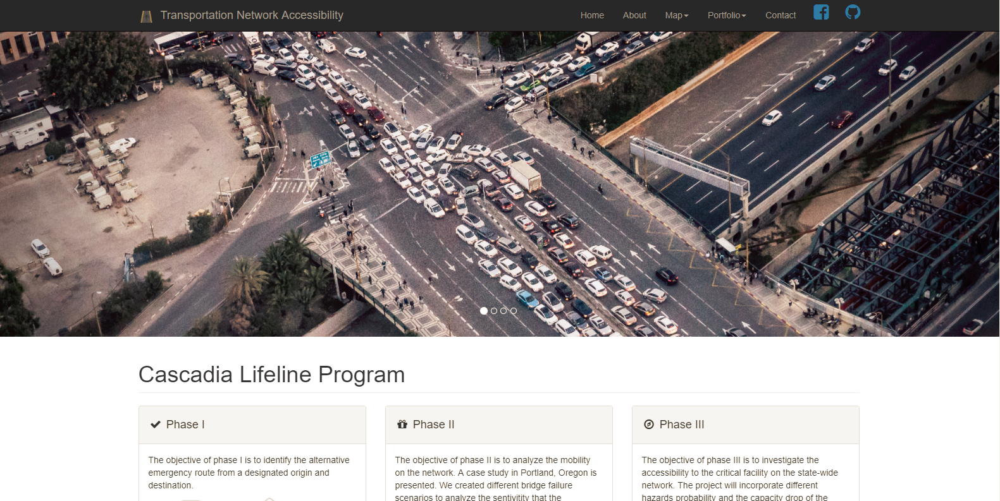
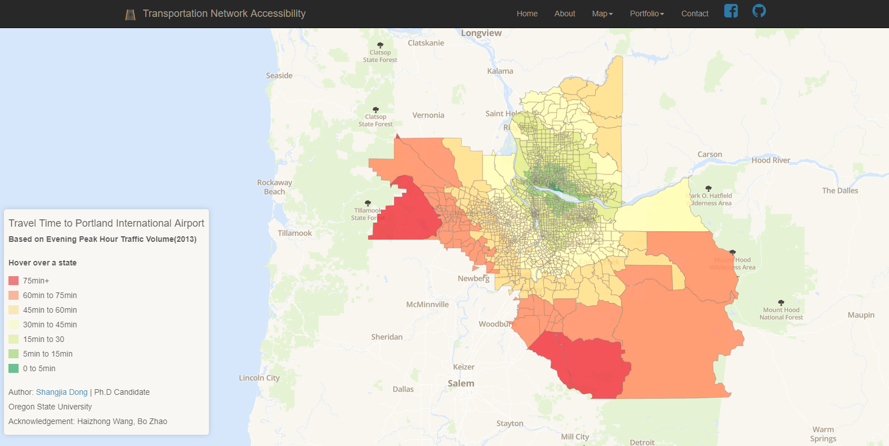
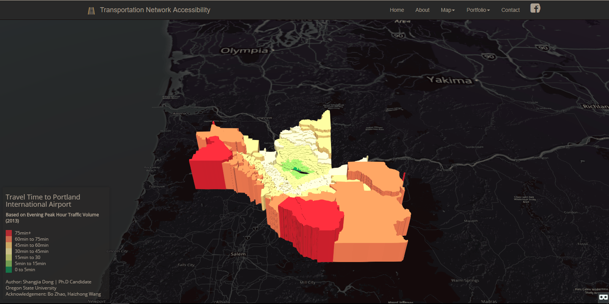
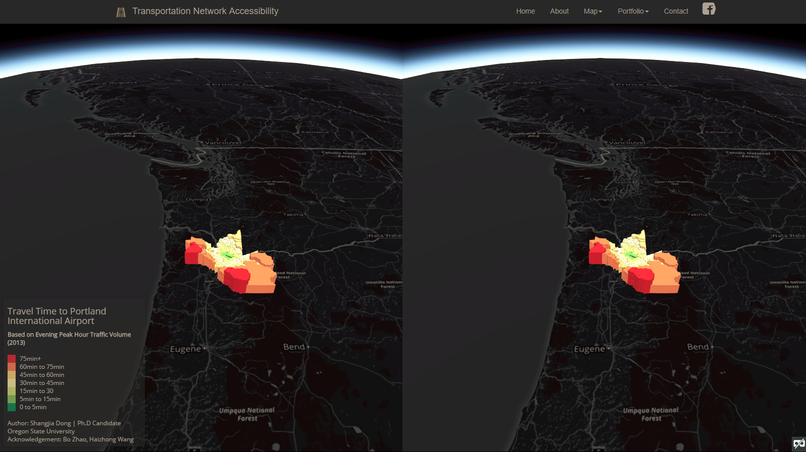

## Post-Disaster Transportation Network Accessibility 



> The web page can be found [here](https://shangjiadong.github.io/netAcce/).

### Introduction

Pacific Northwest region is highly prone to a M9 Cascadia Subduction Zone earthquake.  This poses a great threat on the network’s functionality. The accessibility to critical facility and mobility on the network is of our concern. This project will collaborate with [O-HELP](ohelp.oregonstate.edu) and incorporate different hazard probabilities and their potential impact on transportation network in order to investigate the accessibility and mobility after the disaster. The project is part of the [Cascadia Lifeline Program (CLiP)](http://cascadia.oregonstate.edu/) at Oregon State University. 

### Objective 

The accessibility to critical facilities such as hospital, fire station,  restoration warehouse etc. are essential for post-disaster recovery, without which will result in a catastrophe. An earthquake can induce landslide or liquefaction, which will lead to potential failure of the roadway, and further paralyze the traffic. This project aims to develop a framework to analyze the accessibility on transportation network under different scales of network disruption. First we create a model in VISUM to approximate the real-life traffic scenario. Under different disruptions, the link capacity will be reduced to simulate the disastrous effect on transportation network. Here, travel time is calculated to represent the accessibility on the network. After the simulation, the travel time both on links and from zone to zone will be extracted and visualized with web application. 

### Web Architecture 

The website can be divided into five sections: homepage, about the project, map services, past projects portfolio, and contact information. Before actually design the map, I had conducted an web interface sketch , which can be found [here][interfaceSketch.PNG].

Homepage set the tune of the visualization. It gives a short clip on past phases of the project, and provides a quick link to the detailed information. It also briefly illustrates the background of the project, provides a link to the program, and acknowledges the sponsors of the project. 

About page gives a more detailed background description of the project. Also, it introduces the team members, and lists the sponsors. 

Map services is the main function of the this web application. It contains two maps: 2D map and 3D map. 



2D map visualize the travel time from a bird view. The map shows the travel time from each zone to the Portland International Airport (PDX). Different colors represent the different levels of travel time. Regards to the color use, I chose to use a bivariate color ramp. Because green normally stands for the uncongested traffic, and red indicates the high volume. Therefore, using green for the low travel time, and red for high travel time is very intuitive. To accurately extract the travel time, I added an interactive feature on the map. When the mouse hoover the state, the zone will be highlighted and the travel time will be showed in the legend panel. It is worthy to mention that the base map is created through mapbox. It is included with following code:

```javascript
var map = L.map("map", {zoomControl: false}).setView([45.405755, -123.117511], 9); // deactivate the zoomControl
L.tileLayer('https://api.mapbox.com/styles/v1/shangjia/cj9ohyonk4bnf2rp9lu9pjegl/tiles/256/{z}/{x}/{y}?access_token=pk.eyJ1Ijoic2hhbmdqaWEiLCJhIjoiY2o4eGYybHVtMjFpMTJ3cDhkNTlsNG1qeiJ9.eOP2kq4hzAJaTMg4Rqg5yA',
    {
        detectRetina: true
    }).addTo(map);
```



```javascript
var dataSource = Cesium.GeoJsonDataSource.load('assets/basefile.geojson').then(
    function(dataSource) {
        var p = dataSource.entities.values;
        for (var i = 0; i < p.length; i++) {
            p[i].polygon.material = Cesium.Color.fromCssColorString(setColor(p[i].properties.Travel_Tim));
            p[i].polygon.extrudedHeight = (p[i].properties.Travel_Tim /60)* (p[i].properties.Travel_Tim/60) * 5;
            p[i].polygon.outline = false;
        }
        viewer.dataSources.add(dataSource);
        viewer.zoomTo(dataSource);
    }
);
```

To visualize the data from another angle, I used 3D thematic map to represent the data. As you can see from the map, color and height of polygon represents the level of travel time. The map is like a terrain, the increase of "elevation" makes people feel hard to access, which align with the purpose of the map. The client can use the mouse zone in and out, also toggle the earth to view the map from different angles. I used `ajax` to extract the travel time information form geojson file, and passed it to the `setColor()` function assign colors to different polygons. To add on more interesting features, I used Virtual Reality features.



As you can observe, the window is split into two sections. With a VR gaggle, you can inspect the map from a vivid perspective. `Cesium` is used here to produce the map. 

Other than the map service, I also had portfolio section to show the past work, so that people can track the progress of the project. Last I had a contact page, where people can find the contact information, and also leave a message to me. It is noteworthy that the messaging application through webpage is not fully functioning yet. I will look into the `heroku` and deploy the `php` function there. 

### Reflection 

I started the project by firstly thinking about the main goal I want to achieve through the web mapping, and then decided what data resource I have and what do I message I want to communicate to the public. After deciding on that, I initiated a web interface sketch to build a guideline of the project. Following by that, I started developing the base map for the project. Based on the practice of the labs, I built up the map framework, and added on different interactive features. To added on something more interesting, I tried to use the 3D Thematic map through `cesium`. Finally I put all them together into a website, and added small features. Couple things I can improve later on. First, I can use more interactive features on map to dynamically show the viewer the information and allow them to extract the information they would like to see. Second, the color use of the website can be explored more. Third, other the front end of the webpage, I can develop more back-end functions to store feedbacks or data that viewers provide. Fourth, currently the map is only showing the base version of the travel time. Later on I will continue build upon it and add more disruption scenarios to show the travel time under different hazards. 

### Resource

#### Data

The data used in this project is from my research. The travel time is simulate through VISUM. The VISUM base model is provided by Portland Metro, Oregon. 

#### Toolkit

- **Library**: Leaflet, Bootstrap, Font-awesome, Jquery, Chroma, Cesium 
- **Web Services**:  GitHub, Mapbox etc. 
- **Others**: Color Brewer, Color co., pixabay etc. 

### Credit 

This website is developed by Shangjia Dong @2017. 

### Acknowledgement

I would like to thanks CLiP project and sponsors for the support. Also I would like to thank Dr. Haizhong Wang for the guidance on the research development. Thanks Dr. Bo Zhao for helping on the visualization. 